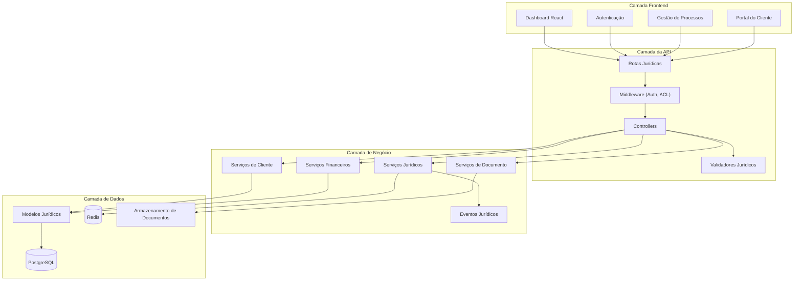

<h1 align="center">
  
</h1>

<p align="center">
  
  
  
  <a href="https://github.com/gabrielmaialva33/benicio-api/commits/main">
    
  </a>
</p>

<p align="center">
    <a href="README.md">Inglês</a>
    ·
    <a href="README-pt.md">Português</a>
</p>

<p align="center">
  <a href="#bookmark-sobre">Sobre</a>&nbsp;&nbsp;&nbsp;|&nbsp;&nbsp;&nbsp;
  <a href="#rocket-desenvolvimento-ai-first">Desenvolvimento AI-First</a>&nbsp;&nbsp;&nbsp;|&nbsp;&nbsp;&nbsp;
  <a href="#computer-tecnologias">Tecnologias</a>&nbsp;&nbsp;&nbsp;|&nbsp;&nbsp;&nbsp;
  <a href="#package-instalação">Instalação</a>&nbsp;&nbsp;&nbsp;|&nbsp;&nbsp;&nbsp;
  <a href="#memo-licença">Licença</a>
</p>

## :bookmark: Sobre

A **API Benício** é um sistema abrangente de gestão advocatícia desenvolvido especificamente para o Benício Advocacia.
Construído com **AdonisJS v6** e React, oferece uma base completa para gerenciar processos jurídicos, clientes,
documentos e todos os aspectos operacionais de um escritório de advocacia moderno.

Este sistema vai além dos softwares jurídicos tradicionais ao oferecer uma arquitetura AI-first que aumenta a
produtividade e permite integração perfeita com fluxos de trabalho de desenvolvimento modernos. Desde gestão de
relacionamento com clientes até acompanhamento de processos, gestão de documentos e supervisão financeira, a API Benício
oferece as ferramentas necessárias para uma gestão eficiente da prática advocatícia.

### 🏗️ Visão Geral da Arquitetura



## :rocket: Desenvolvimento AI-First

A API Benício foi projetada de forma única para maximizar a eficácia da gestão advocatícia assistida por IA.

- **Inteligência de Domínio Jurídico**: O sistema compreende terminologia jurídica, estruturas de processos e
  procedimentos legais brasileiros, facilitando para a IA auxiliar na gestão de casos e geração de documentos jurídicos.
- **Dados Jurídicos Estruturados**: Tipagem completa de entidades jurídicas (processos, clientes, documentos, prazos)
  cria contratos claros que a IA pode entender e manipular com precisão.
- **Arquitetura Jurídica Modular**: Organização orientada ao domínio em torno de práticas jurídicas (litígio, contratos,
  consultas) permite que a IA estenda funcionalidades seguindo convenções legais estabelecidas.
- **Foco na Lógica de Negócio Jurídica**: Com infraestrutura para autenticação, gestão de documentos e acompanhamento de
  casos já resolvida, a IA pode ser direcionada para resolver problemas complexos de fluxo de trabalho jurídico desde o
  primeiro dia.

## 🌟 Principais Funcionalidades

- **⚖️ Gestão de Processos**: Sistema completo de acompanhamento de litígios e processos com gestão de prazos e
  controles processuais.
- **👥 Gestão de Relacionamento com Clientes**: Portal abrangente de clientes com prospecção integrada e acompanhamento
  de relacionamentos.
- **📄 Gestão de Documentos Jurídicos**: Armazenamento seguro de documentos com categorização automática e controle de
  versão.
- **💰 Gestão Financeira**: Faturamento, controle de despesas e relatórios financeiros adaptados para práticas jurídicas.
- **⏰ Gestão de Prazos e Tarefas**: Acompanhamento automatizado de prazos com integração de calendário e sistemas de
  lembrete.
- **📊 Relatórios Jurídicos**: Relatórios abrangentes sobre progresso de casos, desempenho financeiro e análises da
  prática.
- **🔐 Autenticação Segura**: Autenticação multi-fator com controle de acesso baseado em funções para hierarquia de
  escritório de advocacia.
- **🏥 Monitoramento de Saúde**: Monitoramento de sistema integrado para conformidade e supervisão operacional.

## :computer: Tecnologias

- **[AdonisJS v6](https://adonisjs.com/)**: Framework Node.js robusto otimizado para aplicações jurídicas.
- **[React 19](https://reactjs.org/)**: Frontend moderno com componentes e fluxos de trabalho específicos para área
  jurídica.
- **[TypeScript](https://www.typescriptlang.org/)**: Segurança de tipos completa em entidades e fluxos de trabalho
  jurídicos.
- **[PostgreSQL](https://www.postgresql.org/)**: Banco de dados confiável para dados jurídicos sensíveis com trilhas de
  auditoria.
- **[Redis](https://redis.io/)**: Cache de alta performance para pesquisas de casos e indexação de documentos.
- **[VineJS](https://vinejs.dev/)**: Validação de documentos jurídicos com padrões legais brasileiros.
- **[Lucid ORM](https://lucid.adonisjs.com/)**: Modelagem de entidades jurídicas com mapeamento de relacionamentos
  complexos.

## :package: Instalação

### ✔️ Pré-requisitos

- **Node.js** (v18 ou superior)
- **pnpm** (ou npm/yarn)
- **Docker** (para PostgreSQL e Redis)
- **Licença de Prática Jurídica** (para uso em produção)

### 🚀 Começando

1. **Clone o repositório:**

   ```sh
   git clone https://github.com/gabrielmaialva33/benicio-api.git
   cd benicio-api
   ```

2. **Instale as dependências:**

   ```sh
   pnpm install
   ```

3. **Configure as variáveis de ambiente:**

   ```sh
   cp .env.example .env
   ```

   _Configure suas credenciais de banco de dados, chaves de API jurídicas e configurações específicas da prática._

4. **Execute as migrações do banco de dados:**

   ```sh
   node ace migration:run
   ```

5. **Popule com templates jurídicos:**

   ```sh
   node ace db:seed
   ```

6. **Inicie o servidor de desenvolvimento:**
   ```sh
   pnpm dev
   ```
   _Sua API de prática jurídica estará disponível em `http://localhost:3333`._

### 📜 Scripts Disponíveis

- `pnpm dev`: Inicia o servidor de desenvolvimento com hot-reload jurídico.
- `pnpm build`: Compila a aplicação para deploy em produção.
- `pnpm start`: Executa o servidor de prática jurídica em produção.
- `pnpm test`: Executa testes unitários de fluxos de trabalho jurídicos.
- `pnpm test:e2e`: Executa testes de ponta a ponta de processos jurídicos.
- `pnpm lint`: Verifica o código com padrões de codificação jurídica.
- `pnpm format`: Formata o código para documentação de conformidade jurídica.

## 🏛️ Funcionalidades Jurídicas

### Gestão de Processos

- **Acompanhamento de Processos**: Gestão completa de processos jurídicos brasileiros
- **Controle de Prazos**: Acompanhamento automatizado de prazos com integração de calendário jurídico
- **Associação de Documentos**: Vincule documentos a casos e procedimentos específicos
- **Monitoramento de Progresso**: Acompanhamento em tempo real do status do caso e marcos importantes

### Portal do Cliente

- **Dashboard do Cliente**: Acesso dedicado do cliente aos seus casos e documentos
- **Central de Comunicação**: Mensagens seguras entre advogados e clientes
- **Compartilhamento de Documentos**: Acesso controlado a documentos com gestão de permissões
- **Transparência de Faturamento**: Acompanhamento em tempo real de faturamento e despesas

### Gestão da Prática

- **Agendamento de Advogados**: Gestão de calendário com acompanhamento de comparecimentos em tribunal
- **Atribuição de Tarefas**: Distribua trabalho jurídico entre membros da equipe
- **Análises de Performance**: Eficiência da prática e análises de resultados de casos
- **Monitoramento de Conformidade**: Assegure aderência a padrões legais e regulamentações

### Sistema CRM Jurídico

- **Prospecção de Clientes**: Ferramentas avançadas para captação de novos clientes
- **Gestão de Relacionamentos**: Acompanhamento completo do histórico de interações com clientes
- **Pipeline de Vendas**: Controle do funil de conversão de prospects em clientes
- **Análise de Mercado**: Relatórios sobre oportunidades e tendências no mercado jurídico

### Controle Financeiro Especializado

- **Faturamento Jurídico**: Sistema de cobrança adaptado às especificidades da advocacia
- **Controle de Honorários**: Gestão de diferentes tipos de honorários (êxito, contratuais, dativos)
- **Despesas Processuais**: Acompanhamento detalhado de custas judiciais e despesas
- **Relatórios Financeiros**: Análises de lucratividade por área de atuação e cliente

## :memo: Licença

Este projeto está licenciado sob a **Licença MIT**. Veja o arquivo [LICENSE](LICENSE) para mais detalhes.

---

<p align="center">
  Desenvolvido com ⚖️ para excelência jurídica pelo Benício Advocacia.
</p>
