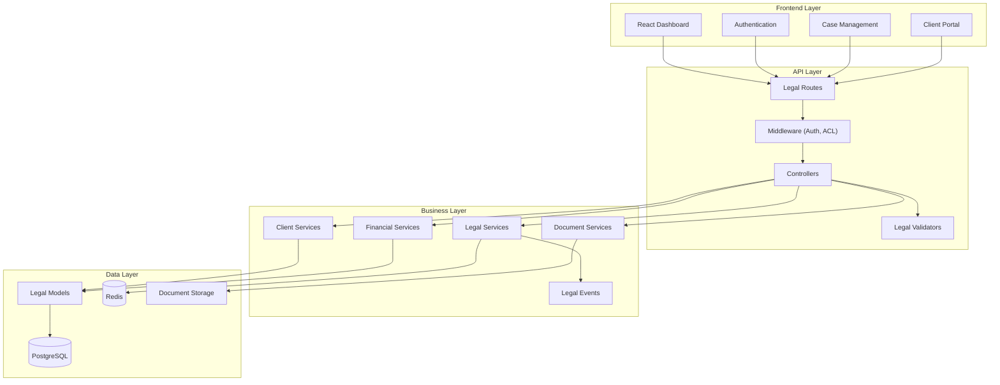

<h1 align="center">
  
</h1>

<p align="center">
  
  
  
  <a href="https://github.com/gabrielmaialva33/benicio-api/commits/main">
    
  </a>
</p>

<p align="center">
    <a href="README.md">English</a>
    ·
    <a href="README-pt.md">Portuguese</a>
</p>

<p align="center">
  <a href="#bookmark-about">About</a>&nbsp;&nbsp;&nbsp;|&nbsp;&nbsp;&nbsp;
  <a href="#rocket-ai-first-development">AI-First Development</a>&nbsp;&nbsp;&nbsp;|&nbsp;&nbsp;&nbsp;
  <a href="#computer-technologies">Technologies</a>&nbsp;&nbsp;&nbsp;|&nbsp;&nbsp;&nbsp;
  <a href="#package-installation">Installation</a>&nbsp;&nbsp;&nbsp;|&nbsp;&nbsp;&nbsp;
  <a href="#memo-license">License</a>
</p>

## :bookmark: About

**Benício API** is a comprehensive legal practice management system designed specifically for Benício Advocacia. Built
with **AdonisJS v6** and React, it provides a complete foundation for managing legal cases, clients, documents, and all
operational aspects of a modern law firm.

This system goes beyond traditional legal software by offering an AI-first architecture that enhances productivity and
enables seamless integration with modern development workflows. From client relationship management to case tracking,
document management, and financial oversight, Benício API delivers the tools necessary for efficient legal practice
management.

### 🏗️ Architecture Overview



## :rocket: AI-First Development

Benício API is uniquely designed to maximize the effectiveness of AI-assisted legal practice management.

- **Legal Domain Intelligence**: The system understands legal terminology, case structures, and Brazilian legal
  procedures, making it easy for AI to assist with case management and legal document generation.
- **Structured Legal Data**: Complete typing of legal entities (cases, clients, documents, deadlines) creates clear
  contracts that AI can understand and manipulate with precision.
- **Modular Legal Architecture**: Domain-driven organization around legal practices (litigation, contracts,
  consultations) enables AI to extend functionality following established legal conventions.
- **Focus on Legal Business Logic**: With infrastructure for authentication, document management, and case tracking
  already handled, AI can be directed to solve complex legal workflow problems from day one.

## 🌟 Key Features

- **⚖️ Case Management**: Complete litigation and case tracking system with deadline management and procedural controls.
- **👥 Client Relationship Management**: Comprehensive client portal with integrated prospecting and relationship
  tracking.
- **📄 Legal Document Management**: Secure document storage with automatic categorization and version control.
- **💰 Financial Management**: Billing, expense tracking, and financial reporting tailored for legal practices.
- **⏰ Deadline & Task Management**: Automated deadline tracking with calendar integration and reminder systems.
- **📊 Legal Reporting**: Comprehensive reports on case progress, financial performance, and practice analytics.
- **🔐 Secure Authentication**: Multi-factor authentication with role-based access control for law firm hierarchy.
- **🏥 Health Monitoring**: Built-in system monitoring for compliance and operational oversight.

## :computer: Technologies

- **[AdonisJS v6](https://adonisjs.com/)**: Robust Node.js framework optimized for legal applications.
- **[React 19](https://reactjs.org/)**: Modern frontend with legal-specific components and workflows.
- **[TypeScript](https://www.typescriptlang.org/)**: Complete type safety across legal entities and workflows.
- **[PostgreSQL](https://www.postgresql.org/)**: Reliable database for sensitive legal data with audit trails.
- **[Redis](https://redis.io/)**: High-performance caching for case searches and document indexing.
- **[VineJS](https://vinejs.dev/)**: Legal document validation with Brazilian legal standards.
- **[Lucid ORM](https://lucid.adonisjs.com/)**: Legal entity modeling with complex relationship mapping.

## :package: Installation

### ✔️ Prerequisites

- **Node.js** (v18 or higher)
- **pnpm** (or npm/yarn)
- **Docker** (for PostgreSQL and Redis)
- **Legal Practice License** (for production use)

### 🚀 Getting Started

1. **Clone the repository:**

   ```sh
   git clone https://github.com/gabrielmaialva33/benicio-api.git
   cd benicio-api
   ```

2. **Install dependencies:**

   ```sh
   pnpm install
   ```

3. **Setup environment variables:**

   ```sh
   cp .env.example .env
   ```

   _Configure your database credentials, legal API keys, and practice-specific settings._

4. **Run database migrations:**

   ```sh
   node ace migration:run
   ```

5. **Seed with legal templates:**

   ```sh
   node ace db:seed
   ```

6. **Start the development server:**
   ```sh
   pnpm dev
   ```
   _Your legal practice API will be available at `http://localhost:3333`._

### 📜 Available Scripts

- `pnpm dev`: Starts the development server with legal hot-reload.
- `pnpm build`: Compiles the application for production deployment.
- `pnpm start`: Runs the production legal practice server.
- `pnpm test`: Executes legal workflow unit tests.
- `pnpm test:e2e`: Executes end-to-end legal process tests.
- `pnpm lint`: Lints codebase with legal coding standards.
- `pnpm format`: Formats code for legal compliance documentation.

## 🏛️ Legal Features

### Case Management

- **Process Tracking**: Complete Brazilian legal process management
- **Deadline Control**: Automated deadline tracking with legal calendar integration
- **Document Association**: Link documents to specific cases and proceedings
- **Progress Monitoring**: Real-time case status and milestone tracking

### Client Portal

- **Client Dashboard**: Dedicated client access to their cases and documents
- **Communication Hub**: Secure messaging between lawyers and clients
- **Document Sharing**: Controlled document access with permission management
- **Billing Transparency**: Real-time billing and expense tracking

### Practice Management

- **Lawyer Scheduling**: Calendar management with court appearance tracking
- **Task Assignment**: Distribute legal work among team members
- **Performance Analytics**: Practice efficiency and case outcome analytics
- **Compliance Monitoring**: Ensure adherence to legal standards and regulations

## :memo: License

This project is licensed under the **MIT License**. See the [LICENSE](LICENSE) file for details.

---

<p align="center">
  Built with ⚖️ for legal excellence by Benício Advocacia.
</p>
